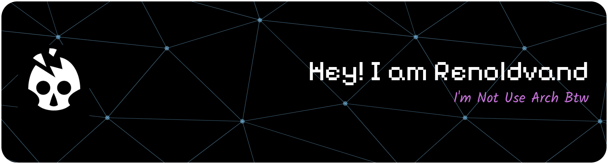

<!--
██████╗  █████╗ ███╗   ███╗ █████╗ 
██╔══██╗██╔══██╗████╗ ████║██╔══██╗
██████╔╝███████║██╔████╔██║███████║
██╔══██╗██╔══██║██║╚██╔╝██║██╔══██║
██║  ██║██║  ██║██║ ╚═╝ ██║██║  ██║
╚═╝  ╚═╝╚═╝  ╚═╝╚═╝     ╚═╝╚═╝  ╚═╝

GitHub Profile README
-->

  

<h1 align="center">Hi 👋, I'm Rama Juliantara</h1>

<h3 align="center">
  Student & Web Developer Enthusiast from Indonesia 🇮🇩
</h3>

  💻 SMKN 1 Denpasar — Grade 11 RPL  
  🚀 Interested in Web Development, PHP Backend, and Python Programming

---

## 🚀 About Me

- 🎓 Student at **SMKN 1 Denpasar**
- 🌱 Currently learning **Frontend & Backend Development**
- 💡 Love building projects to improve my programming skills
- 🧠 Interested in **PHP, JavaScript, Python, and Web UI**
- ⚡ Focused on becoming a better developer every day

---

## 🛠️ Skills & Technologies

---

## 📊 GitHub Stats

  

---

## 🎮 Interests

  

---

## 🐍 Contribution Snake

  

---

## 📫 Contact Me

  

  

  

---

  ✨ Thanks for visiting my profile ✨

